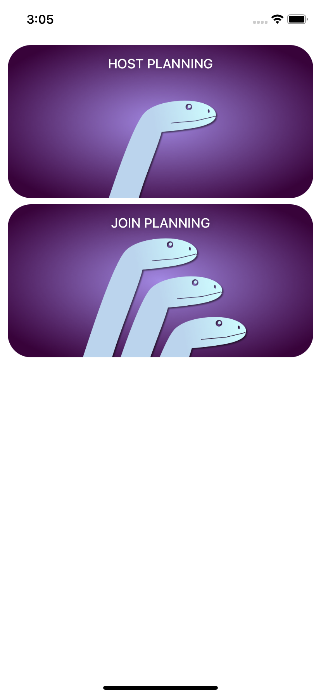
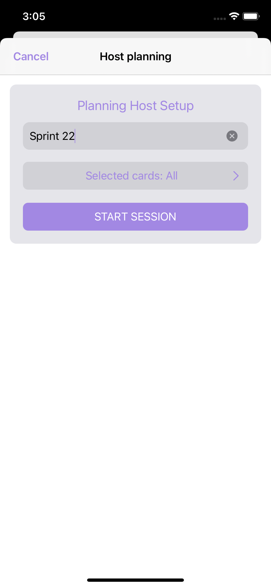
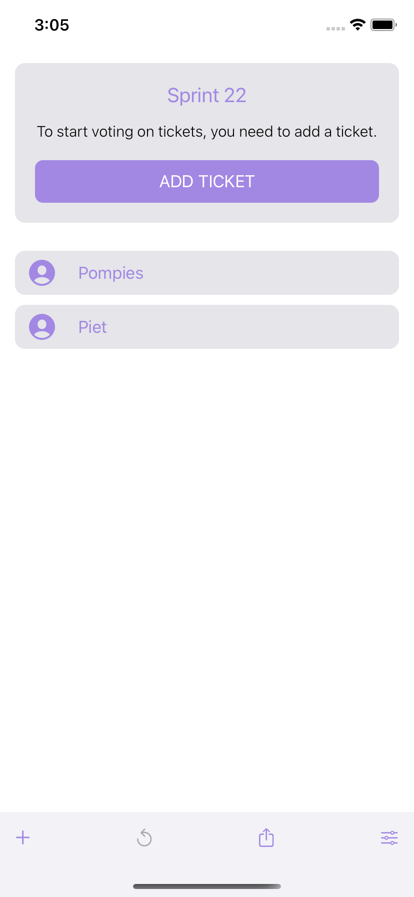
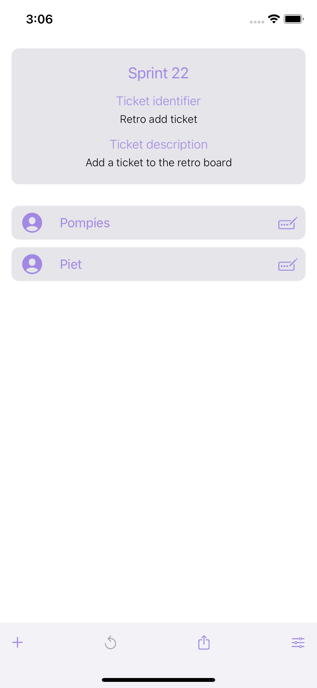
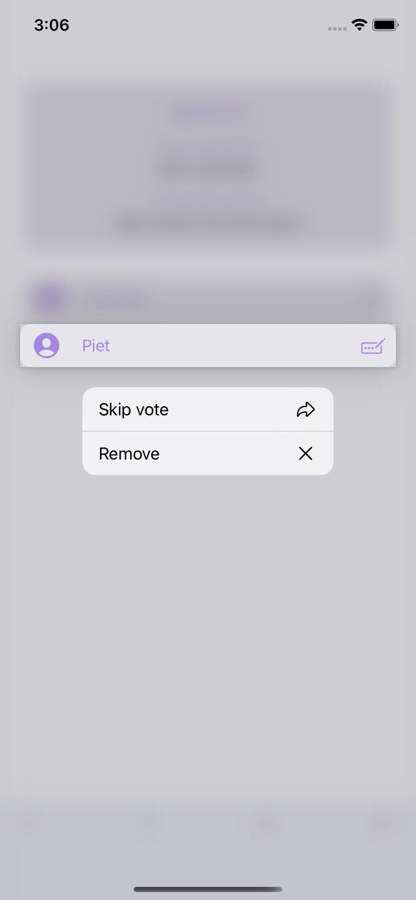
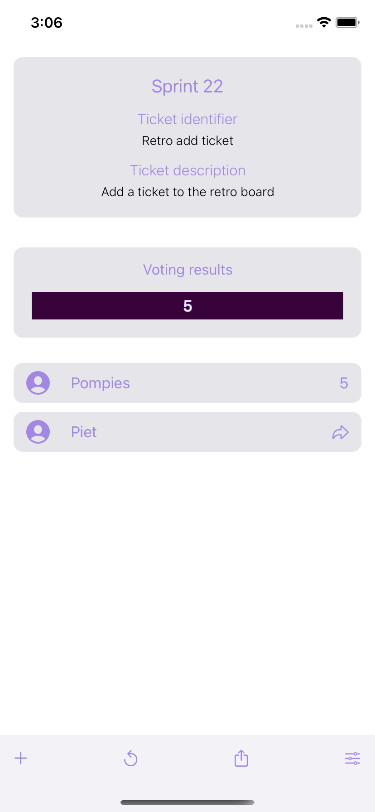

[![Contributors][contributors-shield]][contributors-url]
[![Stargazers][stars-shield]][stars-url]

<br />
<p align="center">
  
</p>


## Table of Contents

* [About the Project](#about-the-project)
  * [Host journey screenshots](#host-journey-screenshots)
  * [Description](#description)
  * [Built With](#built-with)
* [Getting Started](#getting-started)
  * [Prerequisites](#prerequisites)
  * [Installation](#installation)
* [Roadmap](#roadmap)

## About the project

### Host journey screenshots

  
  
  
  
  
  
  
  

### Description

The initial purpose for this app was to practice technical skills by making use of SwiftUI, Combine, and WebSockets.

The app allows a user to host or join a Story Point Planning session and vote on a story.

### Built with

- Swift
- SwiftUI
- Combine
- URLSession WebSockets

## Getting Started

To get a local copy up and running follow these simple example steps.

### Prerequisites

* XCode 12

### Installation

1. Clone the repo
```sh
git clone https://github.com/Operation-Winter/mamba-ios.git
```
2. Open in XCode

## Roadmap

[![Roadmap][roadmap]](https://example.com)


[contributors-shield]: https://img.shields.io/github/contributors/Operation-Winter/mamba-ios?style=flat-square
[contributors-url]: https://github.com/Operation-Winter/mamba-ios/graphs/contributors

[stars-shield]: https://img.shields.io/github/stars/Operation-Winter/mamba-ios?style=flat-square?style=flat-square
[stars-url]: https://github.com/Operation-Winter/mamba-ios/stargazers

[issues-shield]: https://img.shields.io/github/issues/othneildrew/Best-README-Template.svg?style=flat-square
[issues-url]: https://github.com/othneildrew/Best-README-Template/issues

[roadmap]: docs/Roadmap.png