# Planning journey screenshots iPad

## Host journey

<table>
  <tr>
    <td>Landing</td>
    <td>Host planning setup</td>
    <td>Available card selection</td>
  </tr>
  <tr>
    <td valign="top">
        
    </td>
    <td valign="top">
        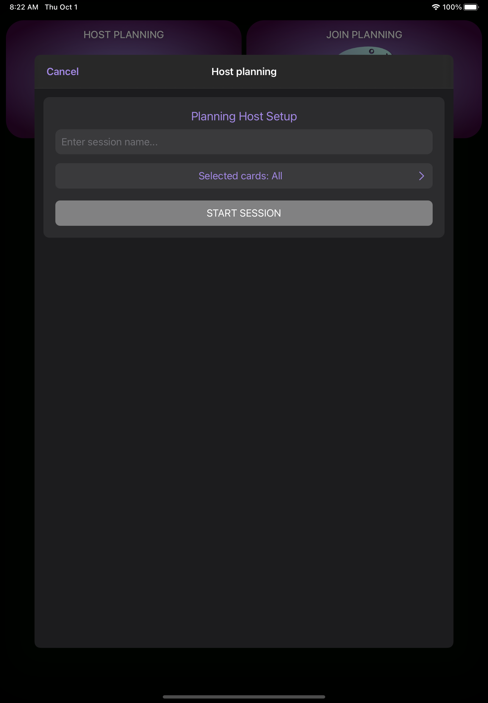
    </td>
    <td valign="top">
        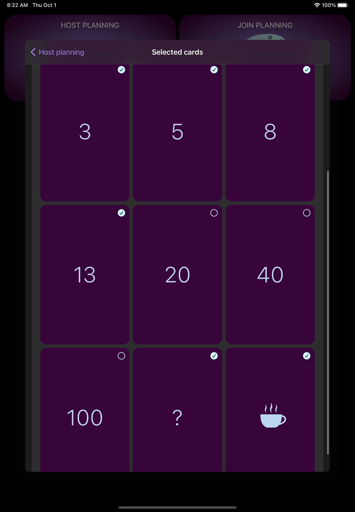
    </td>
  </tr>
  <tr>
    <td>Host session landing</td>
    <td>Add new ticket</td>
    <td>Voting state</td>
  </tr>
  <tr>
    <td valign="top">
        
    </td>
    <td valign="top">
        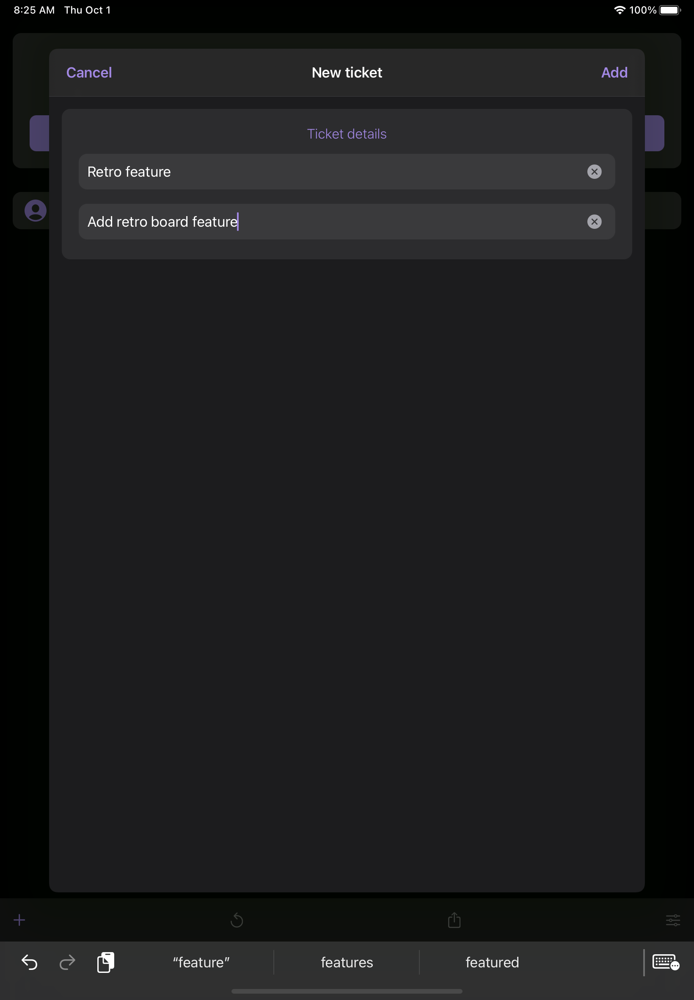
    </td>
    <td valign="top">
        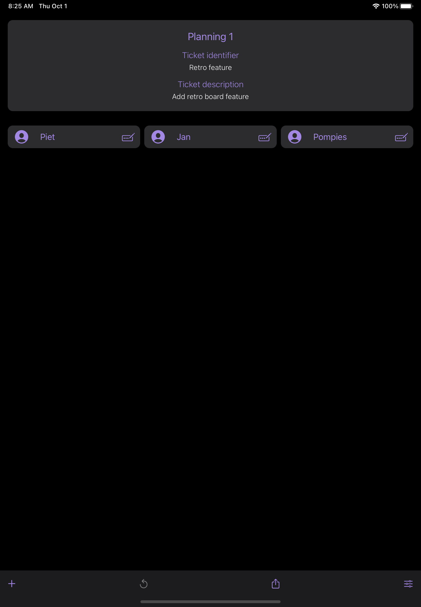
    </td>
  </tr>
  <tr>
    <td>Voting state 2</td>
    <td>Voting state - Skip vote</td>
    <td>Finished voting state</td>
  </tr>
  <tr>
    <td valign="top">
        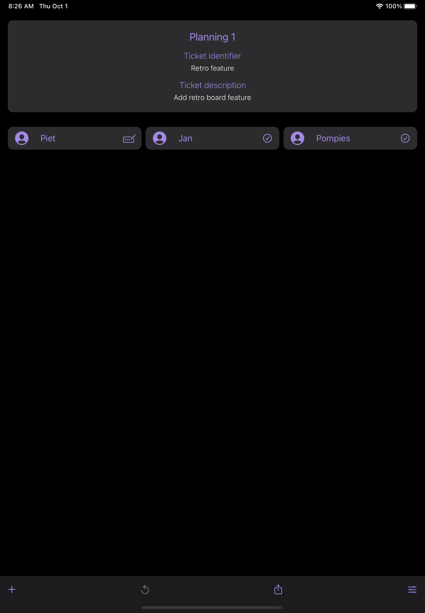
    </td>
    <td valign="top">
        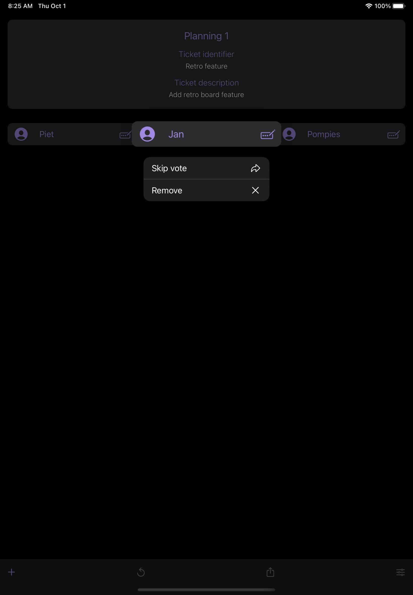
    </td>
    <td valign="top">
        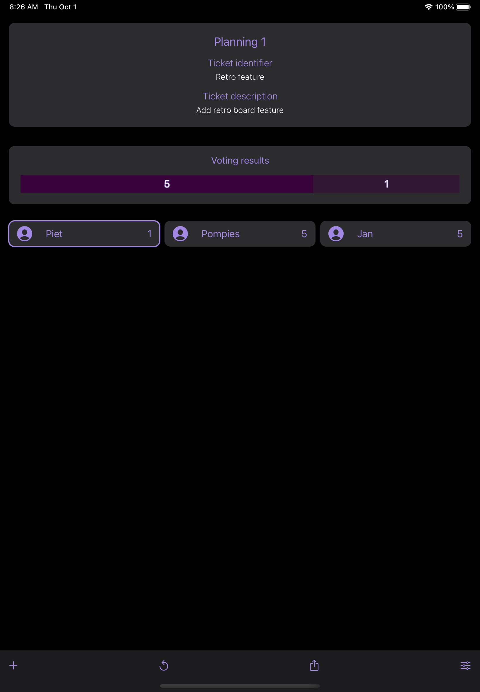
    </td>
  </tr>
 </table>

---

## Join journey

<table>
  <tr>
    <td>Landing</td>
    <td>Join planning setup</td>
    <td>Scan QR Code</td>
  </tr>
  <tr>
    <td valign="top">
        
    </td>
    <td valign="top">
        
    </td>
    <td valign="top">
        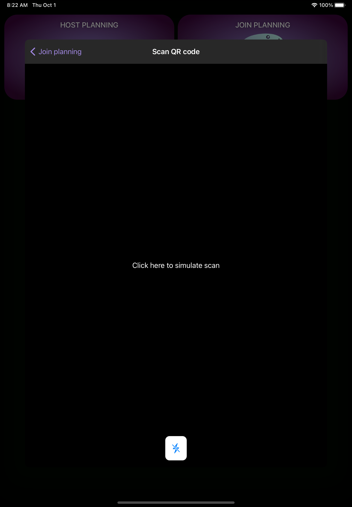
    </td>
  </tr>
  <tr>
    <td>Join session landing</td>
    <td>Share session</td>
    <td>Open menu</td>
  </tr>
  <tr>
    <td valign="top">
        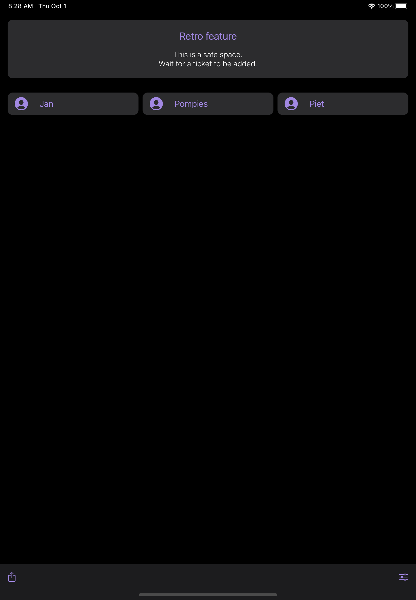
    </td>
    <td valign="top">
        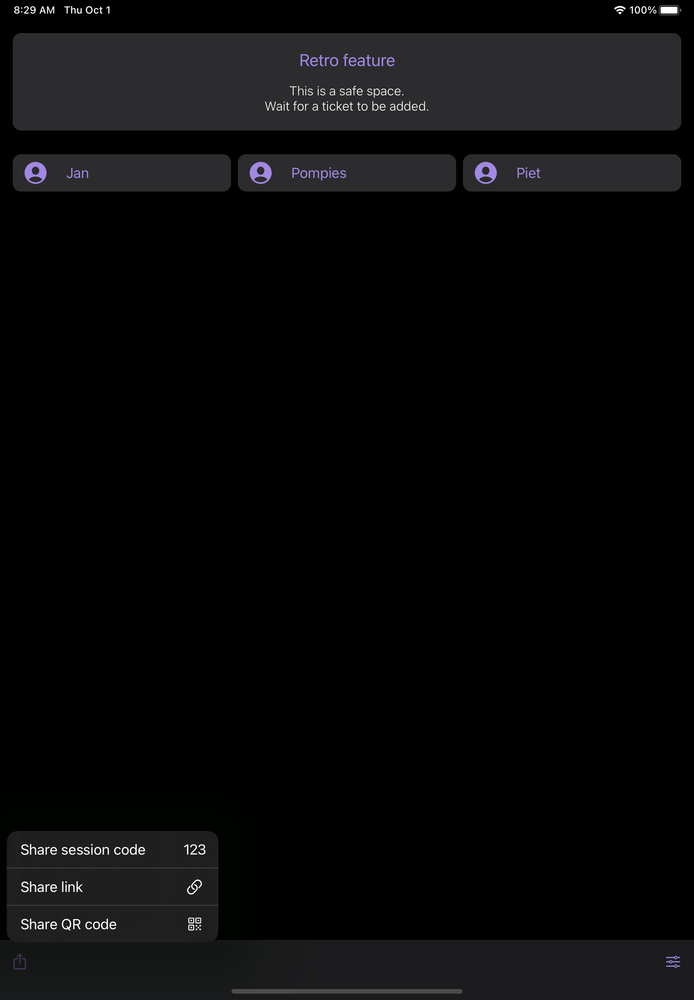
    </td>
    <td valign="top">
        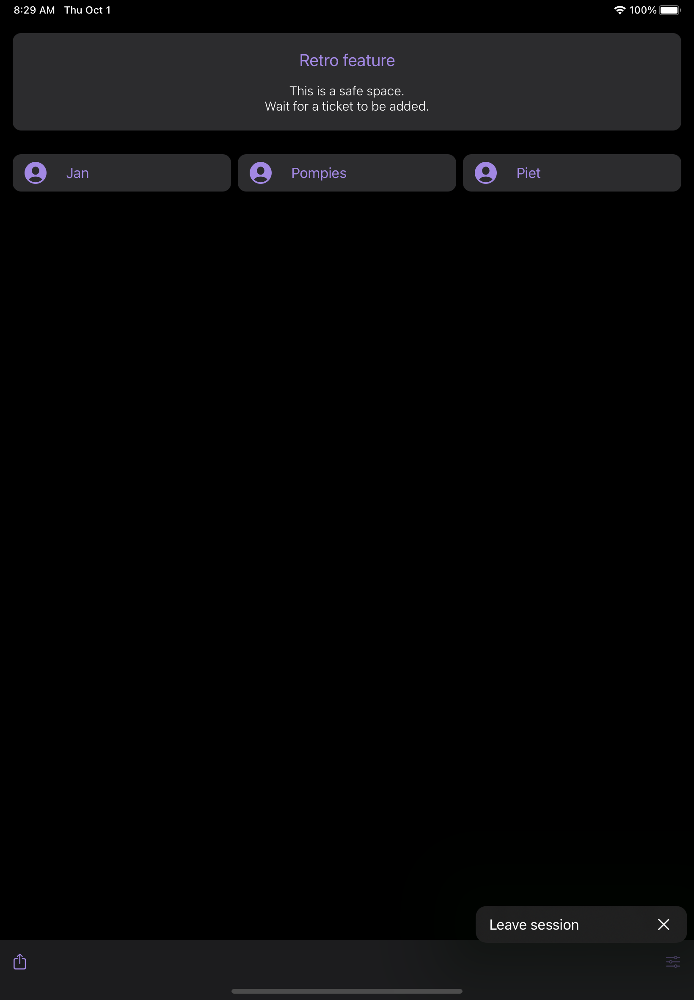
    </td>
  </tr>
  <tr>
    <td>Voting state</td>
    <td>Finished voting state</td>
    <td></td>
  </tr>
  <tr>
    <td valign="top">
        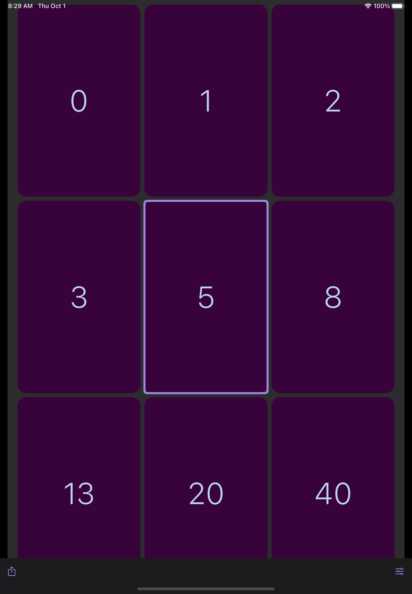
    </td>
    <td valign="top">
        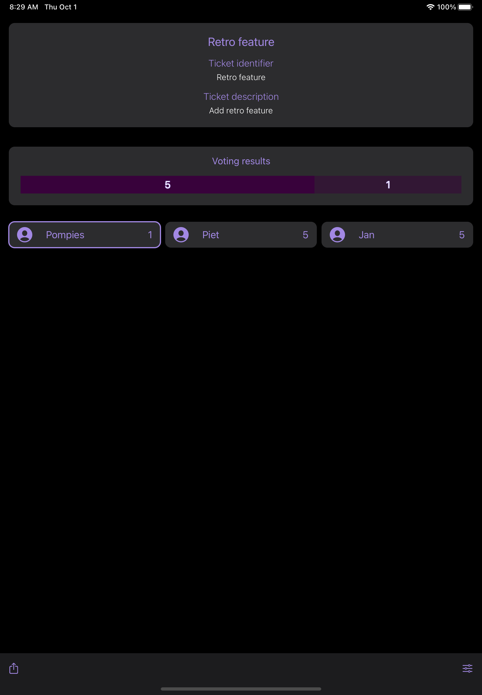
    </td>
    <td valign="top">
    </td>
  </tr>
 </table>
